# fMRI

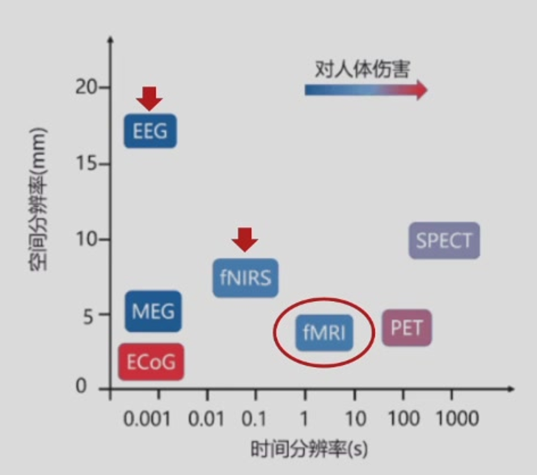

#### 磁共振成像的两大类

- **结构像**：扫描大脑物理结构，区分灰质与白质，观察沟回（“照相机”）。T1常见
- **功能像**：观察大脑在不同状态下的活动情况。T2常见

## MRI优势

- **无创**（非侵入式）
- **高空间分辨率**：约2毫米左右，擅长回答 **“where”**（哪个脑区参与活动）
- **可检测深部脑信号**：如海马、杏仁核等

## MRI核心硬件

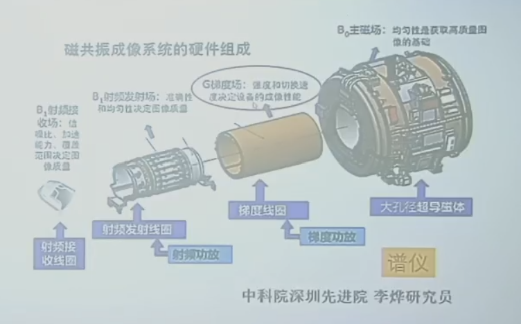

**主磁体：决定成像质量**

“基石”，产生高强、均匀磁场       3T最常见<再高一点动物常见>

为什么不能越高越好？①技术②对人体影响（眩晕等副作用）

实现：低温超导（液氦-270℃左右）

**梯度系统：决定成像性能（→成像快慢/时间分辨率）**

“发动机”，成像快慢&&梯度编码、空间定位      XYZ轴施加梯度磁场

Z轴用于层面选择，XY轴用于层内定位

**射频系统：成像的核心过程**

“雷达”，激发人体共振，采集MR回波信号      最终实现成像

**谱仪系统**

“大脑”，组织协调，各模块时钟协同

**辅助设备：实际研究过程的操作         p.s.**所有设备都是核磁兼容的

## 成像原理

### MRI成像原理

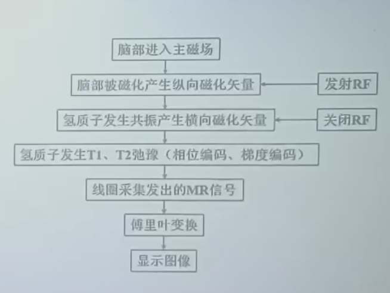

#### 氢核自旋

对氢质子进行成像      存在于游离态水分子

氢核自旋产生磁化矢量，方向随机，抵消，不产生宏观磁化矢量

---

放进主磁场：发生进动【进动频率∝磁场强度】，进动产生宏观纵向（水平方向随机任旧抵消）矢量M（与主磁场同向）

宏观纵向M非常小，无法直接用于成像

#### 射频系统RF

发射RF：（垂直方向上发射）产生共振，纵向M消失，形成横向M

撤去RF：散相产生横向弛豫T2<横向M快速衰减到0>   与   纵向弛豫T1<纵向M逐步恢复>

T1弛豫时间：恢复到63%

T2弛豫时间：衰减到37%

氢含量不同弛豫时间不同

**信号采集时M越大，成像越亮** <得到了一张黑白图>

!!! info

    不同组织T1 T2值不同，加权成像
    
    T1值越大（e.g.水），纵向M恢复慢，MR信号强度越低（黑）
    
    T2值大（e.g.水），横向M减少慢，MR信号高（白）
    
    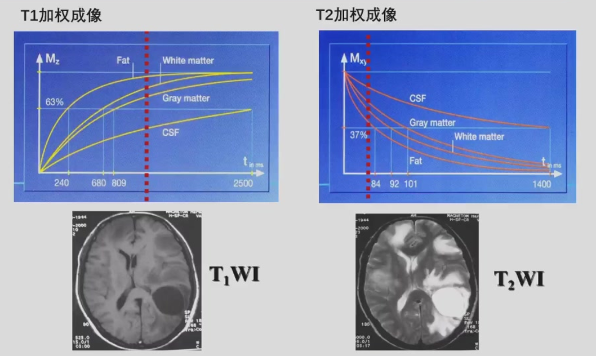
    

Q：为什么要用两种不同的方式成像？

1. 相互验证，准确性问题
2. （两种像通常情况下是黑白相反的，但并不是完全对应）
    1. T1解剖结构清晰，灰白质对比好  时间：**s级**
        1. 区别组织边界明显
        2. 脂肪明显
    2. T2病理改变敏感，液体和病变显示为亮信号  时间：**ms级**
        1. 对水的显示特别亮，那么就对水肿这种自由水相关病变非常敏感

Q：T1 T2不同的时间特征会不会跟是否应用于功能成像相关？

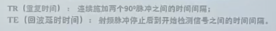

TR决定时间分辨率

p.s.TR 是指两次连续的扫描（即采集整幅大脑图像）之间的时间间隔【注意不是“一次完整扫描的总时长”】

### fMRI成像原理：BOLD

- **全称**：血氧水平依赖信号
- **基本原理**：
    - 脑区活动 → 耗氧量增加 → 血氧血红蛋白含量变化 → 引起**微弱**磁场变化  thus  fMRI检测该变化
- **重点**：fMRI不直接测量神经放电，而是测量*血氧代谢的变化*（神经血管耦合）

BOLD信号是fMRI最常用的信号，原理与近红外（fNIRS）类似。

#### HRF

##### 1. HRF函数响应函数

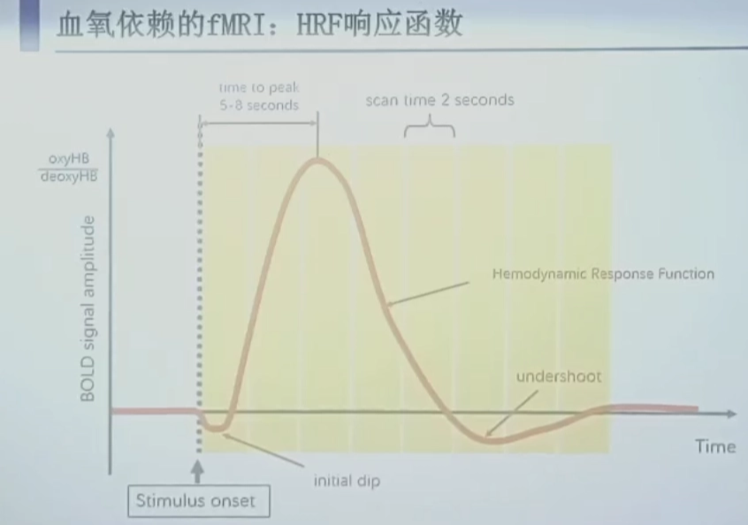

大脑对一次刺激引发的BOLD信号随时间变化的曲线

p.s.也可能是引起一个非常强的抑制信号

- 关键时间点：
    - 刺激出现后**5~8秒**信号达到峰值（不是瞬时的！）
    - 整个HRF持续约**16~20秒**才能回到基线
- fMRI信号有延迟性，解释数据时必须往前推诱发的时刻
- 实验设计必须考虑HRF的时间特性

##### 2. HRF的线性叠加性

- 多个刺激间隔足够近时，它们引发的BOLD信号会线性叠加
- 这是组块设计和快速事件相关设计的理论基础

#### BOLD-fMRI成像质量

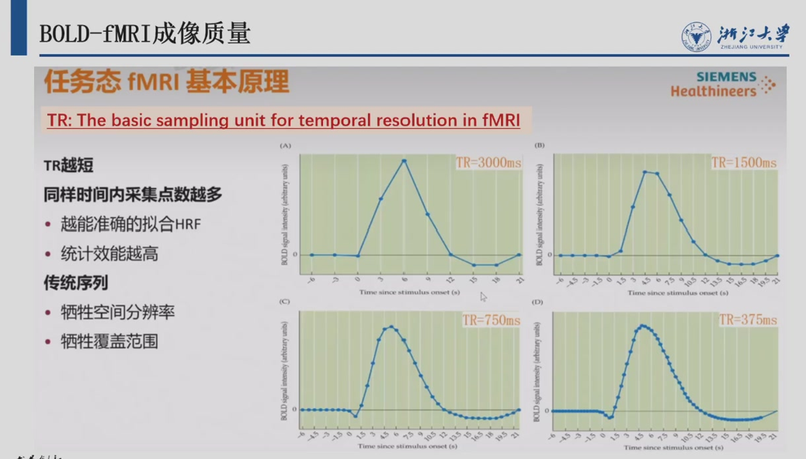

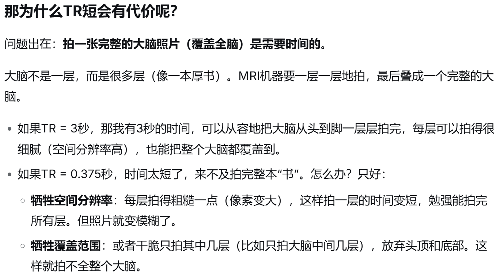

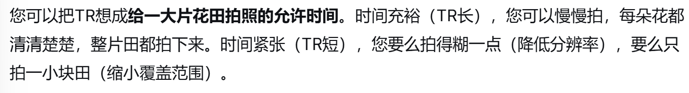

## 实验设计

### 实验设计的基本思路

1. 明确研究问题（决定对信号时空分辨率的要求）
    
    detection（足够的强度） VS estimation（足够的时间去呈现）
    
    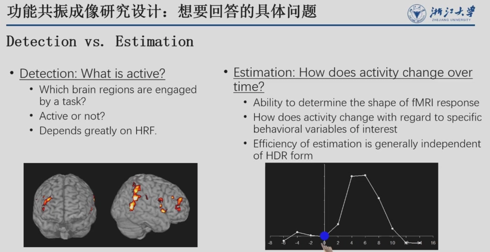
    
2. 提出研究假设（可证伪，支持xx；不支持xx）
3. 实验设计（共性/特性问题）

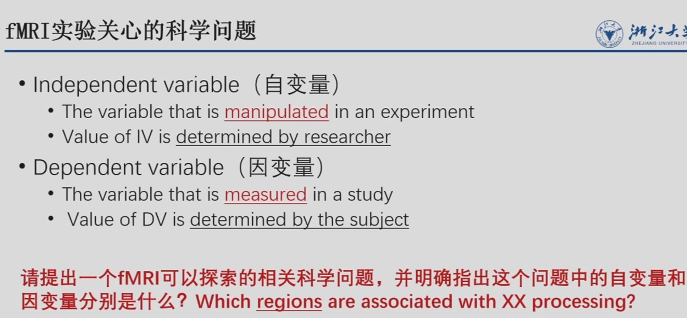

### 常见实验设计类型

#### 1. 组块设计

- **做法**：一段时间内持续做同一类任务（如30秒任务，30秒休息）
    - TEST-REST得到任务相关的信号
- **优点**：
    - 检测效能最强（信号叠加后更明显）
    - 分析相对简单（任务期 vs 休息期的均值比较）
- **缺点**：
    - 容易受信号漂移（block是有一段时间的，磁场等条件可能会发生变化）影响
    - 存在期望效应（被试知道接下来是什么任务）
- **组块时长**：15~20秒（太短回不到基线，太长相同时间内采样次数少**i.e.效率问题疲劳问题**）
    
    考虑①信号特征②被试能够接受的最大时长
    

> 有些实验没办法block  i.e.每个刺激是唯一的、不可重复的情况
> 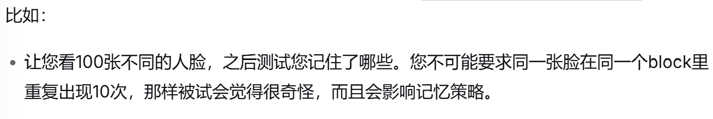
> ---
> 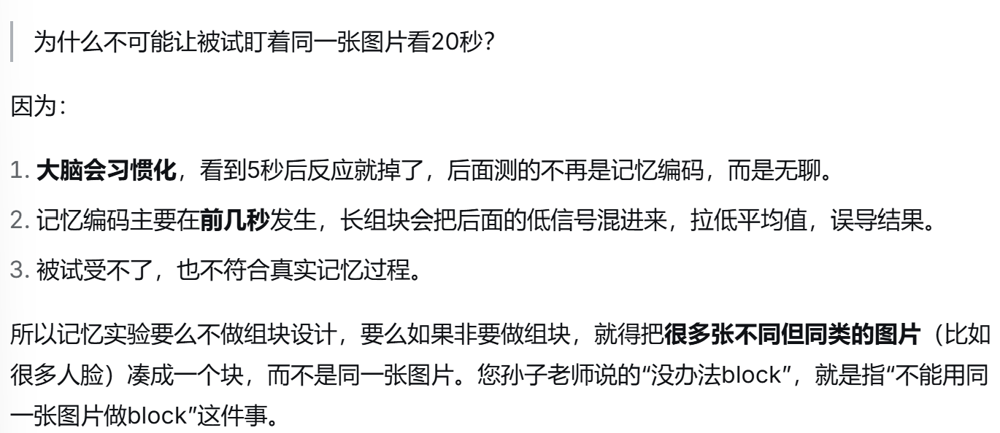

#### 2. 事件相关设计

##### 慢速事件相关

- 每个刺激间隔足够长（如20秒），保证HRF完全回到基线
- **优点**：非常清晰
- **缺点**：效率低，一分钟只能呈现3个刺激，被试容易胡思乱想

##### 快速事件相关（更常用）

- 刺激持续短（平均4~6秒），以随机化的间隔呈现
- **关键要求**：刺激***顺序***和***间隔***必须是随机化的，否则无法通过反卷积分离信号
- **优点**：效率高、更自然、可以事后根据被试行为（如记住vs忘记）分类分析

通过叠加平均得到单个事件引发的大脑活动。

- **jitter处理**：随机化刺激间隔
    
    避免相邻刺激的血流动力学响应完全重叠，从而允许使用统计模型分离出每个事件对应的脑响应，提升估计效率。
    

快速高效的代价是：BOLD信号还没完全回到基线，下一个事件就开始了。需要靠**精细的时间信息**，把不同事件的信号从互相重叠的曲线里拆分开来。

!!! tip
    💡
    
    BLOCK是一个极端，慢速事件相关也是，快速事件相关取了个中间值
    

#### 3. 混合设计

BLOCK里嵌套 快速事件相关

---

#### 信噪比

---

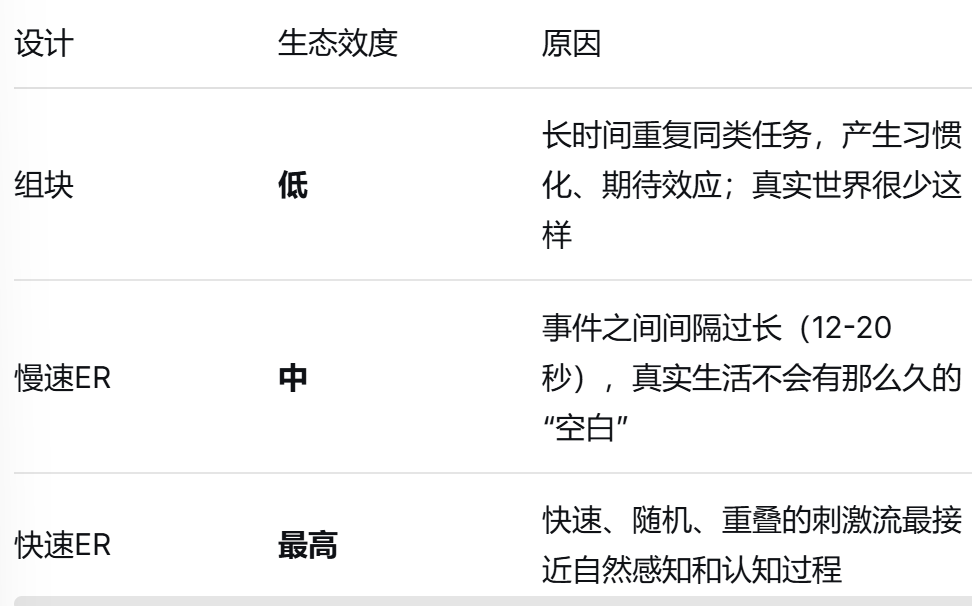

### 减法原则

- 实验条件 = 包含感兴趣成分的任务
- 对照条件 = 除感兴趣成分外，包含尽可能多的其他成分
- 两者相减 → 得到感兴趣成分对应的脑活动

## 数据采集

确定扫描序列：各项成像参数提前确定

任务呈现所需要的设备需要提前测试

2位主试：被试引导（换衣服，知情同意，在外面就开始解释了）+fMRI扫描

- 标准化指导语
    
    标准化的，保证每个人接触到的都是一样的
    
    把流程告诉他很重要，知道了就不会慌
    
- 保持良好沟通
    
    比如，疲惫就休息【但是不能出来，出来再进去要重新扫描】
    
- 填写实验记录单
    
    记录与被试相关的，任何可能影响实验结果的事件
    
- 实时头动检测
    
    头动对影像的影响很大。场越强，成像越清晰头动影响越大。某些个体e.g.ADHD、老年人很难做fMRI。
    
    说话等其他部位动也会引起头动。
    

## 数据分析

### 预处理

噪音

图片配准

常见数据格式：DICOM&NIFTI

Visually check

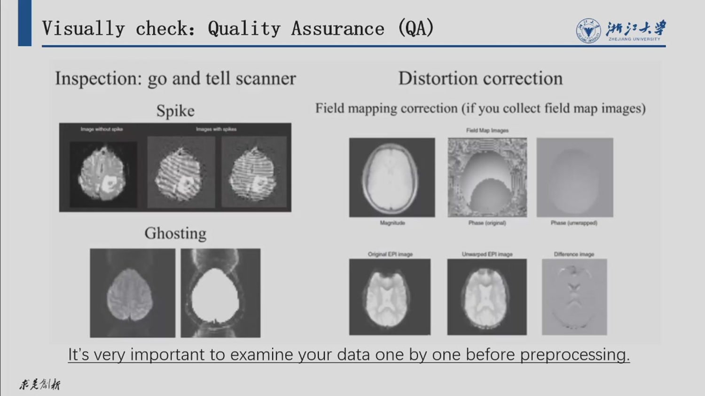

①匀质②形状（异物）

Main Processing Steps

1. Slice timing correction：层时校正
    
    常见的拍法：顺序拍/间隔拍
    
    大脑是一层一层拍的，每层之间有时间差，校正就是把这个时间差给“抹平”，让所有层的时间对齐
    
    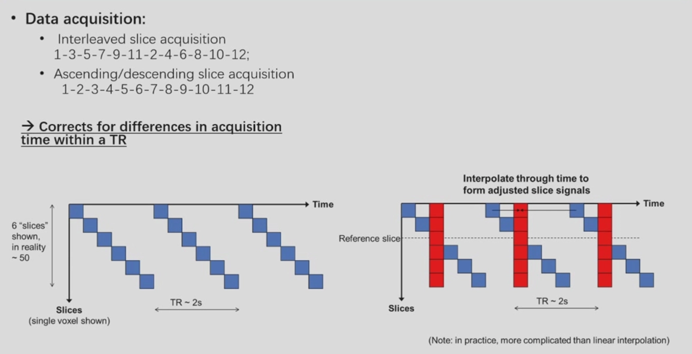
    
    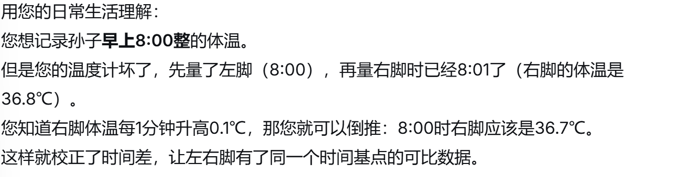
    
    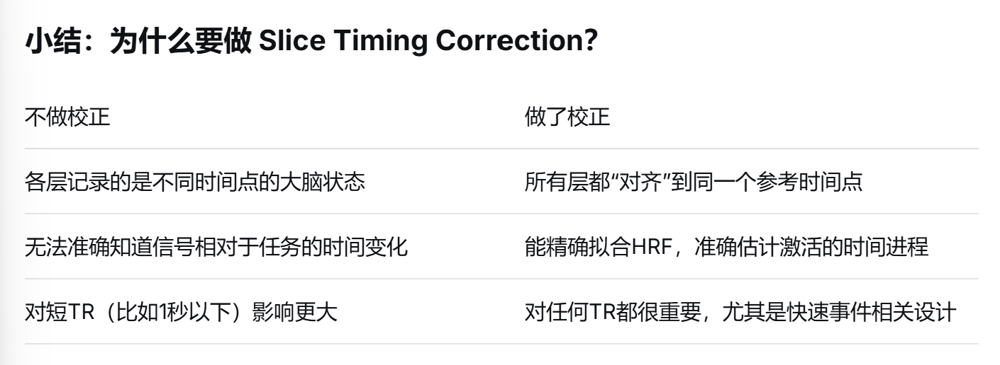
    
    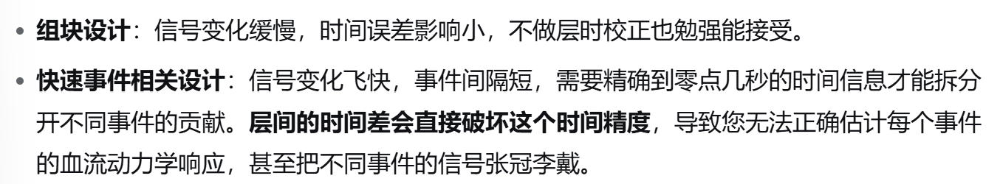
    
2. Head motion correction
    
    头动不大的情况下也是可以接受的，进行校准即可。
    
    边缘容易受到影响
    
3. Normalization（registration）：标准化
    
    
    | across subjects跨被试 | across modalities of images跨模态 |
    | --- | --- |
    | 把不同人的大脑图像变形对齐到同一个标准模板上。i.e.模板对齐
    p.s.模板来自于 [常模 or 20个人当场平均一下]  | 跟T1像【高清】配准（把功能像配到结构像） |
    
    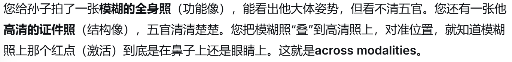
    
    体素voxel（fMRI成像单位 约三万i.e.分辨率）
    
    三种配准方法：
    
    landmark：粗糙，只找几个标志点对齐。
    
    volume（体素）：常用，精细程度一般。一个体素一个体素地去匹配，让变形后的大脑和模板的亮度差异最小化
    
    surface：算法重建表面，对接标准模板
    
4. Smoothing：平滑
    
    用空间上相邻的几个体素（voxel）的信号平均值，来代替原来单个体素的信号值。
    thus：噪声被抑制了，真实信号更突出，但图像变模糊了。
    
    p.s.有一些实验不需要，比如表征多模态分析不能做（因为它要区分体素集合之间的精细反应模式）
    

### 数据分析流程

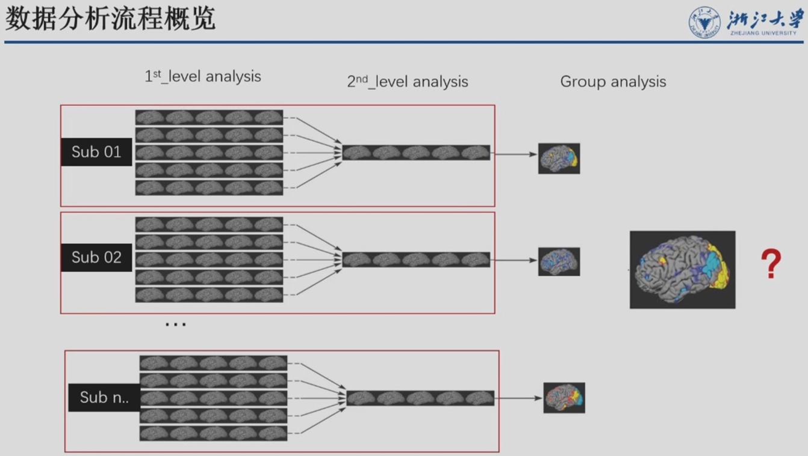

1. 1st-level analysis：针对单个人（比如孙子一个人）的数据，看他大脑哪些体素在任务期间比休息时更亮。
    
    针对每个被试单独进行，目的是建立一般线性模型（GLM），估计各条件下的脑活动，并通过设定contrast提取感兴趣的效应。
    
2. 2nd-level analysis：个体内的统计，得到一个更可靠的个体激活图
    
    第一级分析只是初步估计，第二级会把一个人里面多次扫描（比如同一个任务重复了好几遍）的信号再平均、再检验，得出这个人的“确定性”激活结果
    
3. group analysis：把所有被试的个体统计结果拿过来，放到同一个标准空间里，看整个群体平均下来哪些脑区是真的激活。

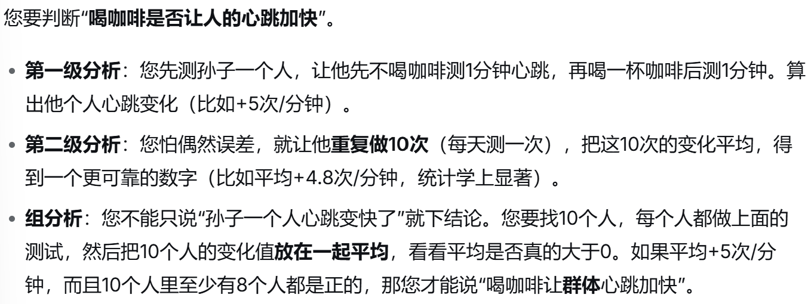

**多重比较矫正(非常重要)**

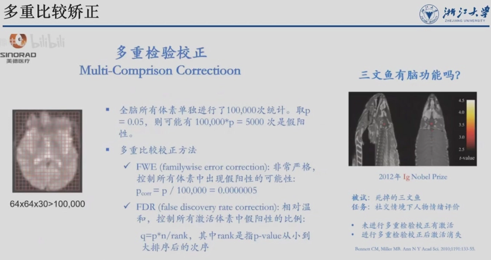

对10万个体素做检验，即使大脑完全没有激活，纯属噪声，我们也会看到大约 10万 × 0.05 = 5000个体素被错误地报告为“激活”

fMRI一定要做