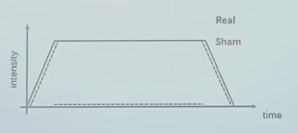
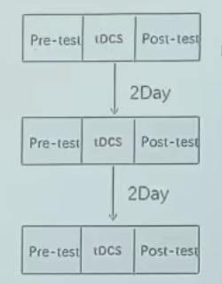

# 无创神经调控

## 为什么要做神经调控研究？

### 脑—行为间因果关系检验

神经活动与认知过程复杂对应  单靠成像很难说明因果

尸检、脑损伤（手术e.g.癫痫患者H.M.：切掉大部分海马后无法形成长时记忆）、无创调控

前两个比较局限①很难遇到恰好感兴趣的脑区受损的人②不够specific，一个区域太大

### 对行为进行有目的性的**干预**

最终肯定都是要干预的

## 神经调控生物基础：大脑可塑性

可塑性：在内外力作用下的可变性：

内：发育、衰退   i.e.大脑自身发展

外：教育、损伤、环境、运动（有氧运动尤其）

发育：

横断面数据为主（建立常模），但是纵向数据很有价值

“构建人类生命周期脑图表”

后天环境：

损伤后修复：

后天盲人视觉皮层也会在触摸盲文时激活，但是不如先天强

不同层级上都具有可塑性

## 神经调控常用技术

手术时为了避免切掉多的区域，不停的用微电流刺激，比如刺激后出现无法说话等明显异常，那就不能切。这是最早的电刺激应用

- 无创神经调控（被动）：
    
    电、磁（实际还是电）、超声（核心优势：深部干涉脑区）、光（相对前面安全，但是原理还没有那么清楚）
    
- 神经反馈训练（主动）：
    
    给你一个反馈，你能够自发地发现某种方式激活某个脑区，比如想什么东西的时候前额叶非常活跃
    

有创一般时空分辨率更高

### 电调控刺激

- 无创常规电刺激
    - 经颅（无创）直流电刺激
    - 经颅交流电刺激
    - 经颅随机电刺激
- 无创电刺激最新发展
- 植入式深部脑电刺激

#### 直流电tDCS

电休克疗法——>急性自杀自伤想法

- 即时效应on-line effect：
    
    放电阈值↓    放电频率正极增加，负极减小
    
- 离线效应offline effect：
    
    刺激撤去后可以持续一段时间，一定是影响蛋白合成
    

tDCS影响因素：

1. 极性i.e.正极负极【要增强还是抑制】
2. 剂量【安全】
    1. 1.5~2mA   1大概是阈值
    2. 10~30min
    3. 电极接触面积 5*5cm**2
3. 其他

通常是电池供电，相对安全

- 参数设置小结：
    1. 确定刺激点：
        
        EEG 10-20系统
        
    2. 正负极：
        
        正极：感兴趣区域
        
        负极：对侧脸颊、头顶【尽量远，或者找一个确定与实验认知过程无关的地方，不要抑制别的可能干扰研究的脑区】
        
- 刺激条件设置：
    
    > 真刺激：目标刺激
    伪刺激：瞬时电流、对照点
    > 
    
    
    
    有一个上升和下降的过程：没有刺痛
    
    人对电流的变化有感觉，那伪刺激只给上升和下降，中间没有
    
    更多对照：增强+抑制【反向】/电击无关脑区【基准点】
    
    > **被试内设计VS被试间设计：**
    > 
    > 1. 个体差异：大脑结构
    > 2. 后效问题：刺激效果有一段持续时间
    > 
    > 推荐被试内，间隔足够长48h常见【保证所有人都没有后效】
    > 
    
    排除练习效应、偶然因素（比如你很困）
    
    
    
    比较post好还是post-pre好？
    
    电刺激效应的个体差异
    

#### 交流电tACS

1. f：可变  特异改变大脑特定频段的活动   不同频段与不同认知活动相关
2. A：调节两个脑区的神经活动的同步性【电刺激相位同步时，两个脑区更同步】

大部分基于EEG研究，因为频段信息来自EEG

结构像→电流模拟，优化参数

脑电→测出你的频段

#### 随机tRNS

---

最新发展

个性化刺激参数设置：提高刺激的空间精确程度

优化刺激时机：实时检测，因为一直刺激会导致阈值改变【实时脑成像】

深部核团刺激：①基于功能连接②多时间的干涉：包络的刺激

精确无创电刺激：高频