# 眼动基础

## 眼动的生理基础

眼动：视觉系统主动选择信息的行为表现，是大脑加工结果的一种外在体现

眼动追踪本身不直接记录大脑神经活动，但反映认知过程

### 视网膜retina和中央凹fovea

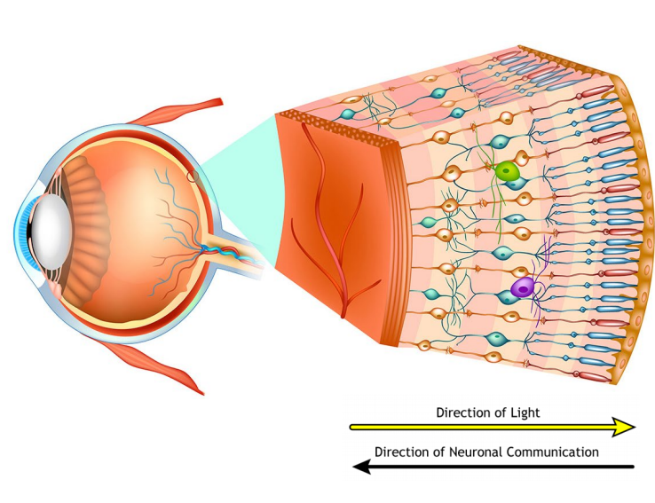

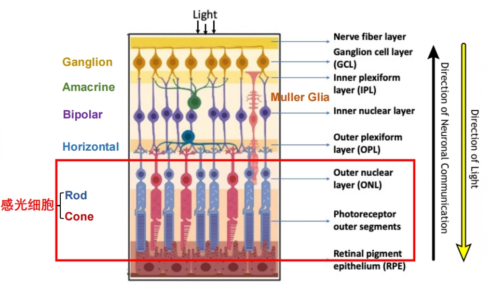

- 视觉传导机制：
①光经过整个视网膜的神经细胞网络到达感光细胞
②视锥细胞、视杆细胞换能作用：光能转化为神经冲动
③传递机制：
感光细胞→双极细胞（第一级）→视神经节细胞（第二级）【视神经节发出的神经纤维视交叉后传至丘脑外侧膝状体】→第三级神经元的纤维【从外侧膝状体发出】【终止于大脑枕叶视觉中枢】
④横向整合：
图中还标注了水平细胞和无长突细胞。它们不是直接传递信号给大脑，而是在横向层面进行调节。水平细胞连接光感受器和双极细胞，无长突细胞连接双极细胞和神经节细胞。它们的作用是进行侧向抑制，增强明暗对比和边缘检测——这是视觉系统在眼球内部进行的初步信息加工，也是"为什么眼动能反映认知"的生理起点之一。

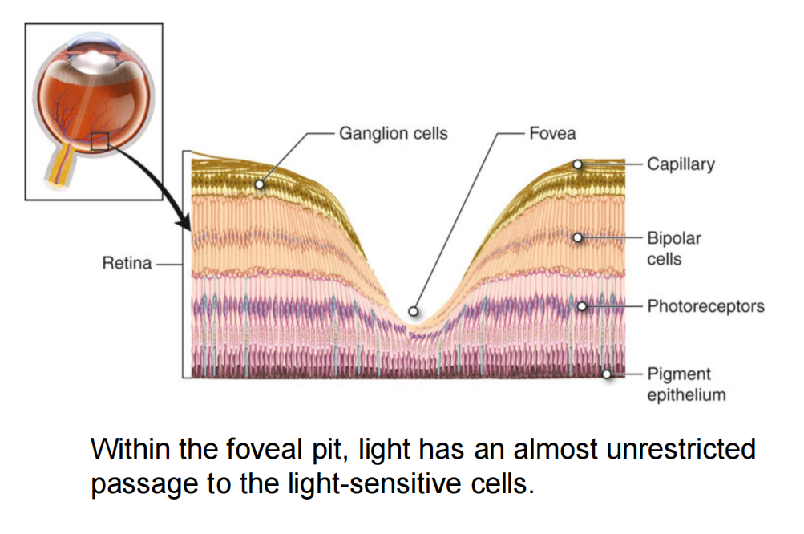

在中央凹处，**光线可以直接到达感光细胞**，最大程度上减少了光的散射和吸收，为高清晰度视觉创造了"物理光学窗口"。

---

- 视锥细胞和视杆细胞功能及分布差异
    - 视锥细胞：明、颜色、精细化
    - 视杆细胞：暗、动态

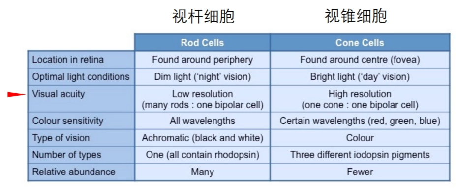

> 一个视锥细胞连接一个双极细胞、再连接一个神经节细胞，保证了信号的高保真度  **||**  大量视杆细胞会汇聚到同一个神经节细胞上，空间分辨率急剧下降
> - 外周视野：视觉拥挤效应
>     - 如果不移动眼睛，你很难识别外周的具体字母。这是因为外周视野中多个物体的信号在视觉通路中互相干扰。这意味着，外围视野只够用来检测"有没有东西"和"东西在哪里"，而无法完成精细的识别。

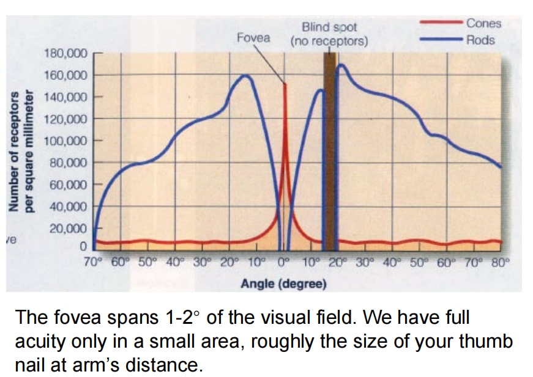

视锥细胞**分辨率高，主要感受细节**，而视锥细胞主要集中在中央凹

---

### 大脑和皮层放大因子the cortical magnification factor

视网膜：接收并把光能转换为化学能量

视神经optic nerve：化学能量激活nerves把message传到大脑

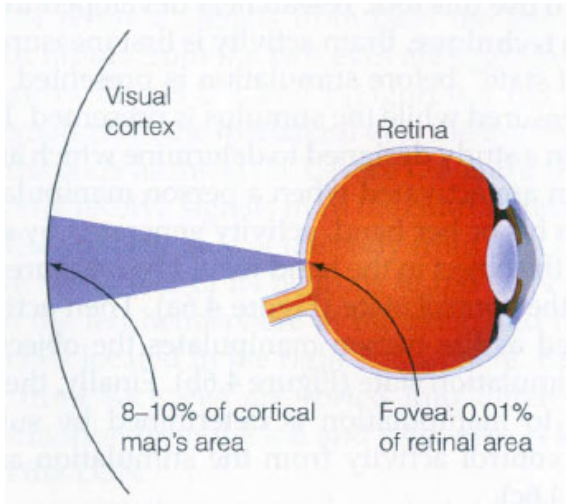

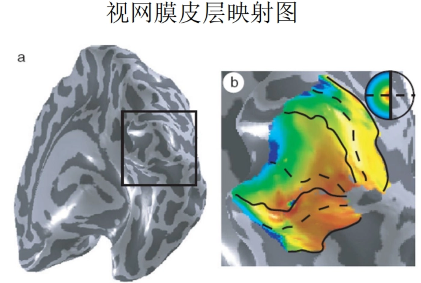

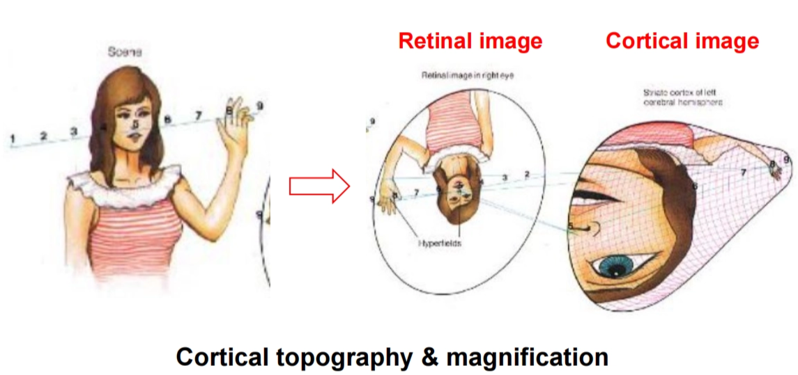

> - 在中央凹处，皮层放大因子约为 0.15°/mm（即视野中每 0.15° 的信息占据皮层 1mm 的范围）
> - 而在距中央凹 20° 的外周位置，这个数字变成 1.5°/mm

**大约 25% 的视觉皮层专门用于处理中央凹2.5° 的视觉场景**

**中央凹信息在皮层中占据了巨大面积**，视网膜上同等大小的视野，中央凹区域在皮层中被放大了约10倍。That means**中央凹看到的东西 = 大脑当前正在重点加工的东西**。

---

### 肌肉

- 三对拮抗肌
这三对肌肉的精密配合，使眼球可以在任意方向上高速旋转，将中央凹对准新的目标
    - 水平运动（内直肌与外直肌）
    - 垂直运动（上直肌与下直肌）
    - 旋转运动（上斜肌与下斜肌）

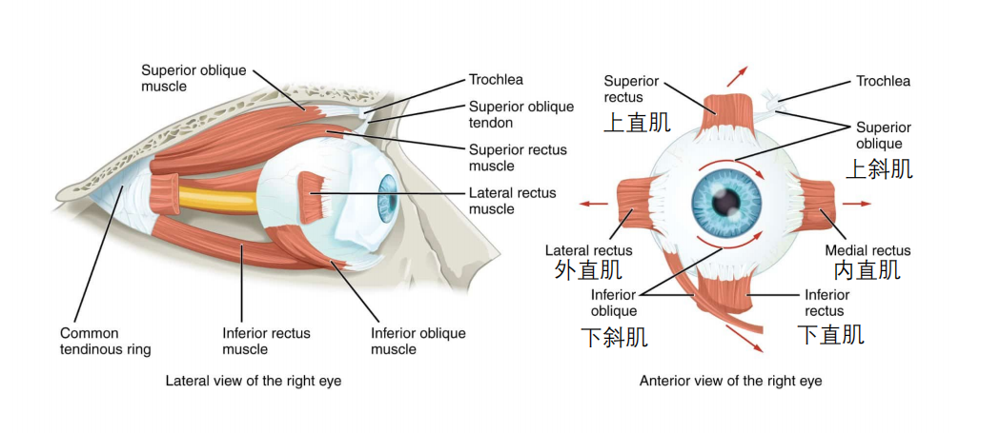

- 中央凹在轴上
大小约一臂距离的大拇指指甲盖大小

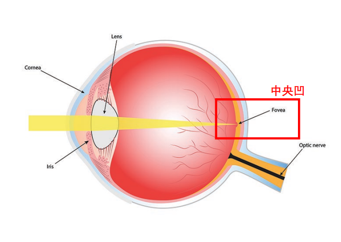

中央凹在眼球后极中心（共轴），而眼球肌肉系统**能够快速、精准地重新部署中央凹**

---

### 总结

视觉系统在结构上"强迫"大脑必须通过移动眼睛来选择信息

!!! tip
    💡
    
    **为什么眼动追踪可以反映认知过程？**
    
    - “清晰看见”依赖于中央凹【外周视野→视觉拥挤效应】
        - 在中央凹处，**光线可以直接到达感光细胞**，衰减较少
        - 视锥细胞**分辨率高**（精细化，主要感受细节），且主要分布在中央凹处
    - “重要”的信息来自中央凹【视觉处理系统给的资源多所以重要】
        - **大脑和皮层放大因子**：中央凹在大脑皮层中占据了很大的面积，即中央凹获取的信息享有优先级（极大的处理资源）
    
    ---
    
    - 中央凹和眼动的关系
        - 非常小+在轴上，所以必须移动：中央凹仅覆盖一臂距离大拇指指甲盖大小的视野+在眼球后极中心
        - 眼球肌肉系统实现移动：实现快速、精准地重新部署

## 眼动的分类与模式

### 注视fixational eye movement

- 定义：眼睛相对稳定地停留在某一位置的阶段

> 不是绝对不动，otherwise会导致神经元适应，即视神经反应下降e.g.雪盲现象（因为周围都一样，动了等于没动）
- 心理学意义
    - 位置：当前正在选择或处理的信息区域
    - 时间：反映加工难度、认知负荷、兴趣程度
    - 次数：某一区域对任务的重要性或吸引力
- 分类

| 类别 | **漂移drift** | **震颤tremor** | **微眼跳microsaccades** |
| --- | --- | --- | --- |
| 速度/频率 | 缓慢（约50 arcmin/s即约 0.83°/s） | 高频（≥100Hz） | 快速
每秒约1-2次 |
|  | 连续 |  |  |
|  | 相对不规则 |  |  |
| 幅度 | 较小，<0.1° | 极小，约0.004° | 小，<1°/0.5° |
| 特点 | 通常出现在微眼跳之间 | 眼球震荡，通常叠加在漂移之上（）相伴而生 | 类似扫视 |

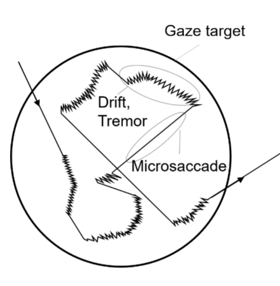

- 后像afterimage可以感觉到微眼跳
    
    > 强刺激适应后，在视网膜或早期视觉系统中留下的暂时性残留影像
    - 注视把眼动抑制到一定水平，视锥细胞产生适应性

### 眼跳saccade

- 定义：眼睛在两个注视点之间快速跳转的运动 <阅读时非常明显>
- 心理学意义
    - 幅度amplitude：信息采样范围
    - 速度velocity：与眼动控制和神经运动机制
    - 方向direction：搜索策略或阅读方向
    - 潜伏期latency：注意转移和反应准备
        - 眼跳潜伏期
        眼跳发生前计划和实施眼跳的时间
        目标刺激出现 到 眼跳开始（150~175ms）
        
        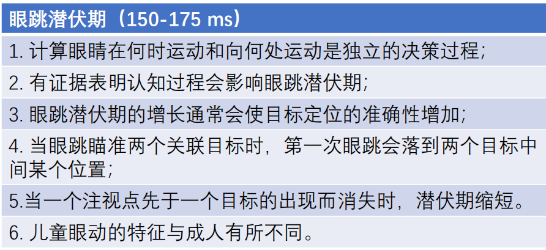
        
        - 认知过程影响眼跳潜伏期
            
            > 如果目标里包含的信息复杂、难以辨别，你的潜伏期就会变长。反过来，如果目标有极强的吸引力，潜伏期也可能被缩短。所以，测量潜伏期的长短，可以用来推断个体在处理信息时的难度和投入程度。
        - 眼跳潜伏期的增长通常会使目标定位的准确性增加
            
            > 更长的准备时间往往意味着更高的精准度。当你有更充足的时间进行神经编码，第一次眼跳就正中目标的概率就会更高。这反映了大脑眼动控制系统为追求精度，会策略性地延长时间。
        - 全局效应
            
            > 当屏幕上同时出现两个较近的目标时，你的第一发眼跳很可能没有落在任何一个目标上，而是落在两者之间的中点。这说明在大脑加工的第一个阶段，两个目标被视为了一个整体。要做出精确的眼跳，大脑需要更多时间来将这个模糊的整体解析为两个独立的目标。这个现象生动地证明，潜伏期内大脑对视觉信息的处理是分层的，先从模糊整体到清晰细节。
        - 注视点先于目标消失，潜伏期缩短
            
            > 眼跳潜伏期不只是感觉器官的反应时间，其中包含了**注意脱离**和**运动准备**这两个可被分离的认知/神经过程。当你人为地提前完成"脱离"，潜伏期就显著缩短。
        - 存在年龄差异
            
            > 儿童眼动的特征与成人不同，他们控制眼动的脑区尚在发育，潜伏期通常更长
- 眼跳抑制
正在眼跳过程中，眼睛对视觉输入的敏感性会降低
    
    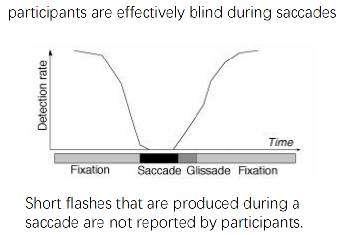
    
    - 眼跳期间的闪光不会被被试报告
    
    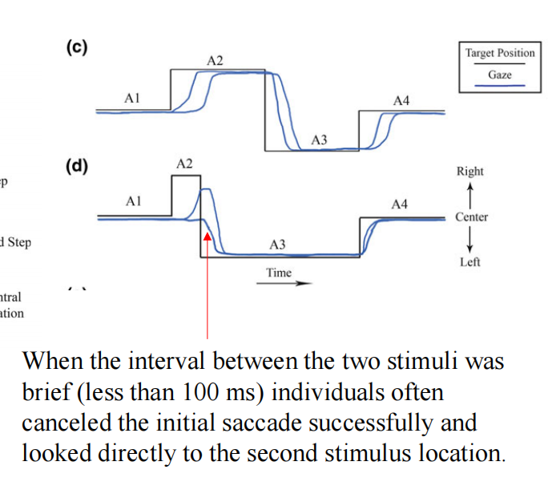
    
    - ↑ 两个刺激之间间隔<100ms时直接看向第二个刺激
    
    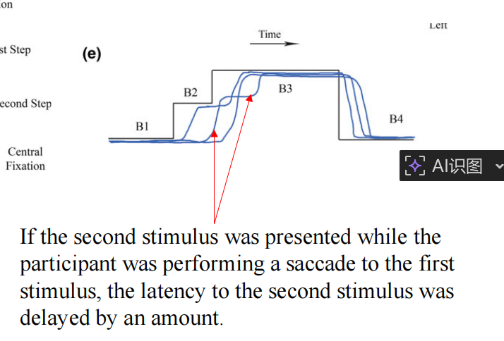
    
    - 在第一个眼跳过程中呈现第二个眼跳，第二个眼跳潜伏期的时间会明显变长

### 追随运动smooth pursuit

> 相对研究会少一点，与运动关系更大一点
- 定义：观看运动物体时，头不动，眼睛追随物体运动
p.s.通常需要一个真实的运动目标，人很难在没有移动目标的情况下随意产生稳定的平滑追踪运动
- 心理学意义
    - 运动知觉
    - 预测性视觉加工
    - 动作控制
    - 注意与视觉运动整合

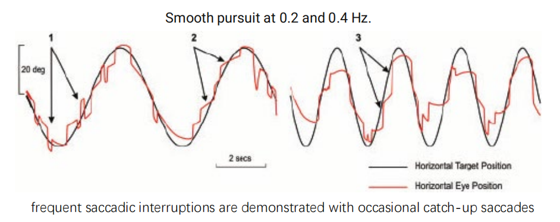

上面这个图可以看到追踪其实是不太好的，尤其是速度比较快的时候，但是我们可以通过一些方法：

- （补偿眼动）头部或身体运动时，为注视一个物体，眼球做出与头部或身体运动方向相反的运动
    
    > 老师上课给的解释是，追不上的时候快一点到物理刺激前面等等它

---

## 眼动记录方法与技术

- 眼动追踪eye tracking记录什么？
    - eye positions
    - eye movement

---

!!! tip
    💡
    
    - 总之，要记录：
        - horizontal(x)&&vertical(y)
        - positions of gaze overtime(t)

### 传统方法

- 观察法
    - 直接：（为减小干扰）镜子、偷窥孔法
    - 间接：后像<被试自己报告>
        - 无主试预期但引入了被试预期
        
        > <因为它固定在视网膜上，大脑补偿机制失效>
        我自己的理解是：网像系统，眼动+网动==静止，但是后像在视网膜上是绑定的
- 机械记录
    - 利用角膜凸起
    - 有创+眼球运动受限+精度问题

### 当代方法

#### 眼电图法EOG

- 眼睛周围贴电极片，记录电位差
    - 电位差：角膜与网膜代谢水平差异（0.4-1.0mV）
        
        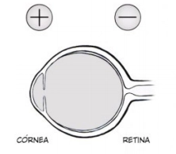
        
- 优点：便宜；高时间分辨率；可测量闭眼眼动
- 缺点：低空间分辨率（我知道你往左看，但是不知道你在看啥），难判断落点 Thus我们多用于诊断（粗糙分类）

#### 电磁感应法（巩膜搜索线圈法）

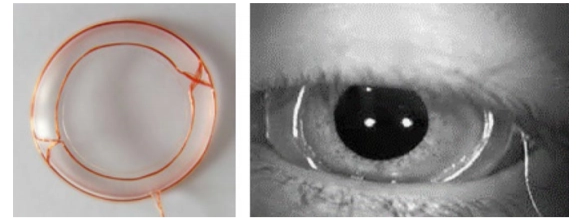

- 优点：高空间（0.01°）&&时间分辨率（1000Hz）
- 缺点：侵入性、不舒适、设备复杂、不适合大样本研究

---

引入眼睛本身光学结构

---

#### 光学记录法<利用光学信号>

眼睛的不同结构（瞳孔、角膜、虹膜和巩膜）在光照下会形成不同的图像特征或反射特征。可以通过这些光学信息估计眼睛的转动方向。

##### 虹膜-巩膜反射法

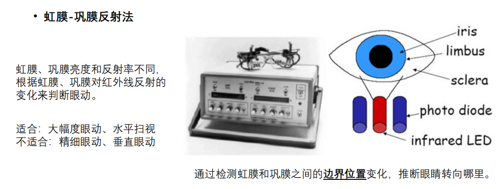

- 为啥用红外：不可见光不会对视觉过程产生干扰，但眼睛可以反射（Then反射率差异记录边界变化）
- 缺点：没有那么精细

##### 普金野图像跟踪法

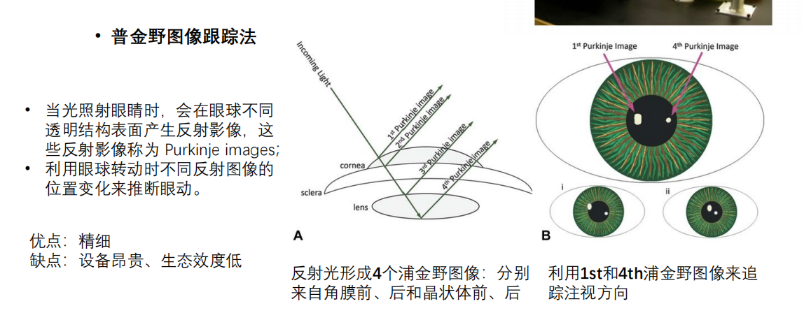

- 四个反射（i.e.普金野反射）利用差异最大的1、4层反射，寻找夹角变化推断眼球运动
- 缺点：太精细，需要控制头动（bitebar）

##### **瞳孔-角膜反射法**

- 工作原理：角膜反射（就是这个亮斑），头不动这个亮斑是不会动的，但眼动的时候瞳孔是会动的

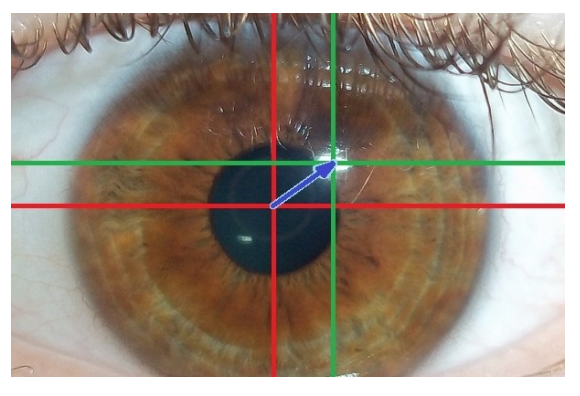

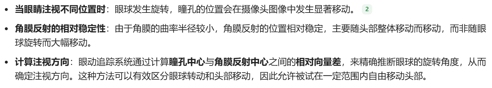

#### 视频记录法

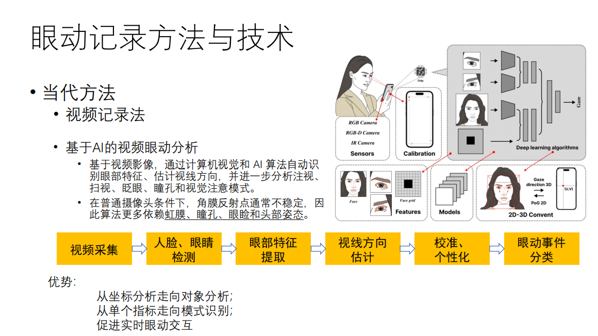