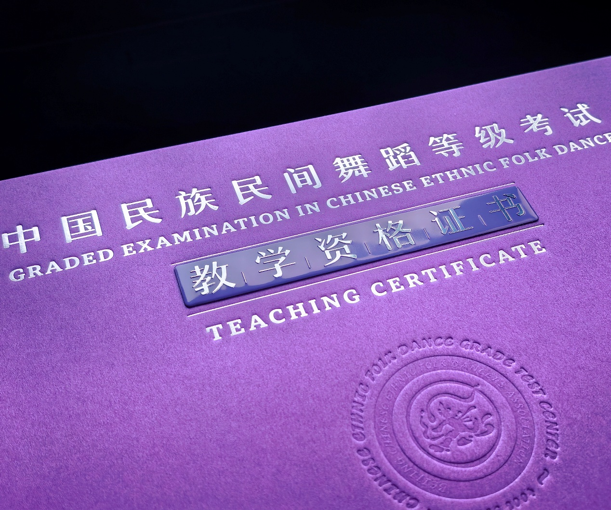
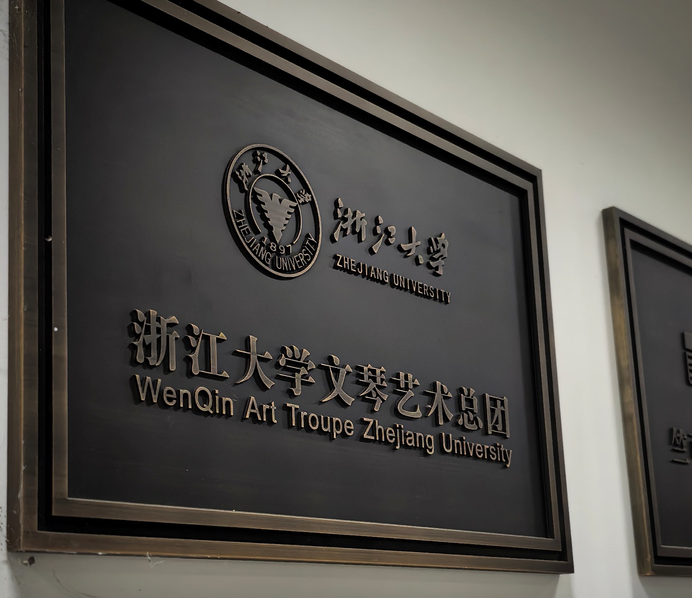
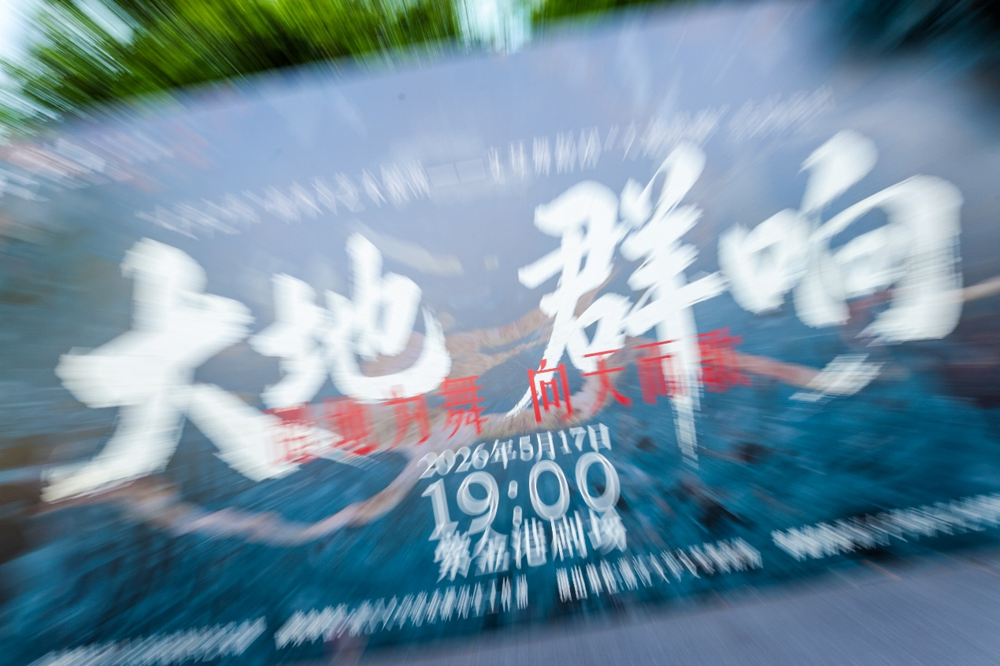
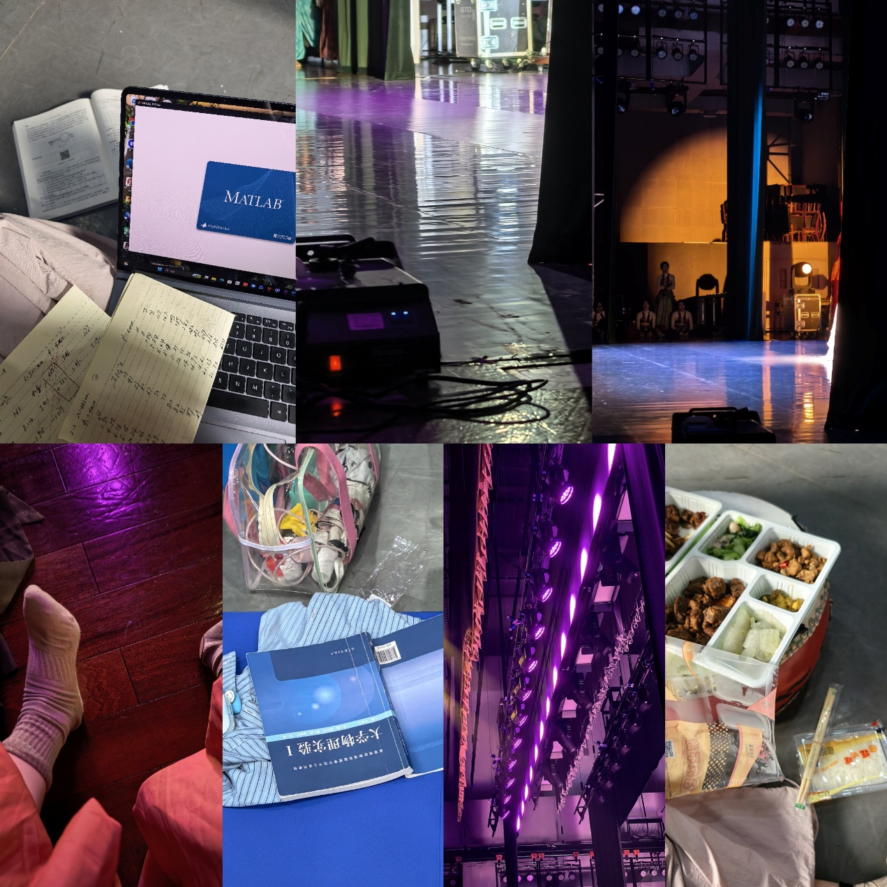
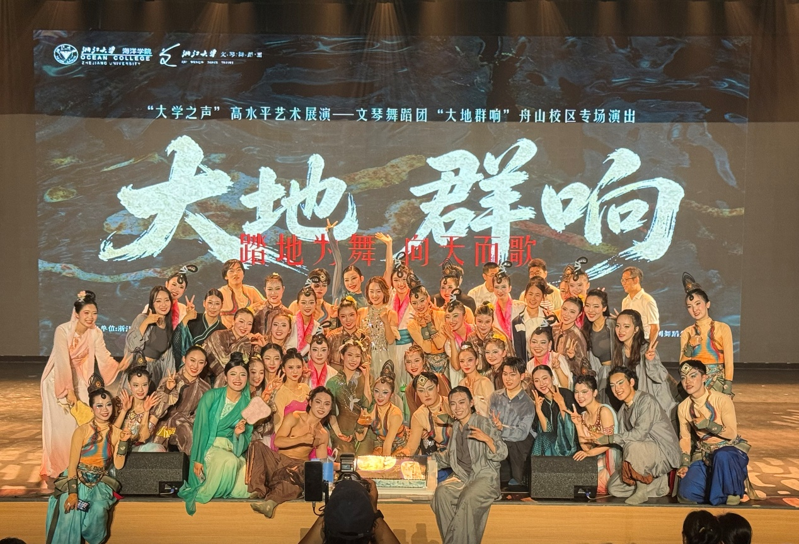

# 舞蹈💃

故事从2011夏天的少年宫开始...

---

  
2025.8

  

  

    
高考结束后考了教师资格证

    

      
    

  

  
2025.9

  

  

    
来到了ZJU加入了文琴舞团！认识了超级厉害超级好的大家！！

    

      
    

  

  
2026.5.17

  

  

    
出演了人生中第一场专场！！！

    

      
    

  

  
2026.5.21

  

  

    
第一次参与ZJU校庆演出！

    
这天是一个普普通通的周四，也是第一次旷这么多课。。。虽然发现并不会影响什么哈哈哈哈

    

      
    

  

  
2026.5.23

  

  

    
来舟山校区演出啦！

    
竟然在七天内演了三场！虽然只在一个剧目里跳了小小的一个角落，但还是很高兴！结束的时候竟然也很不舍

    

      
    

  

